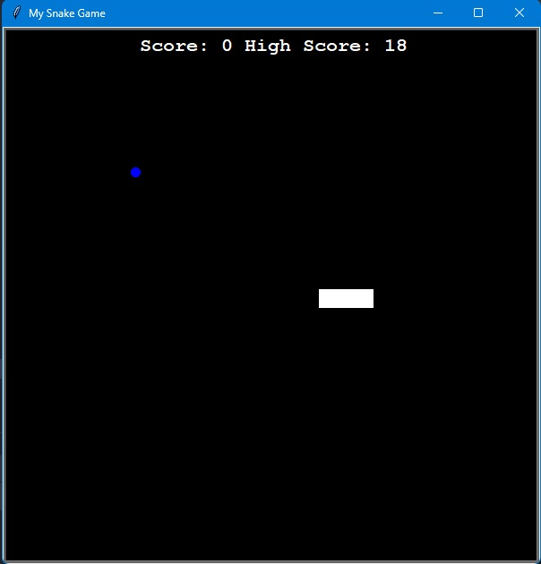
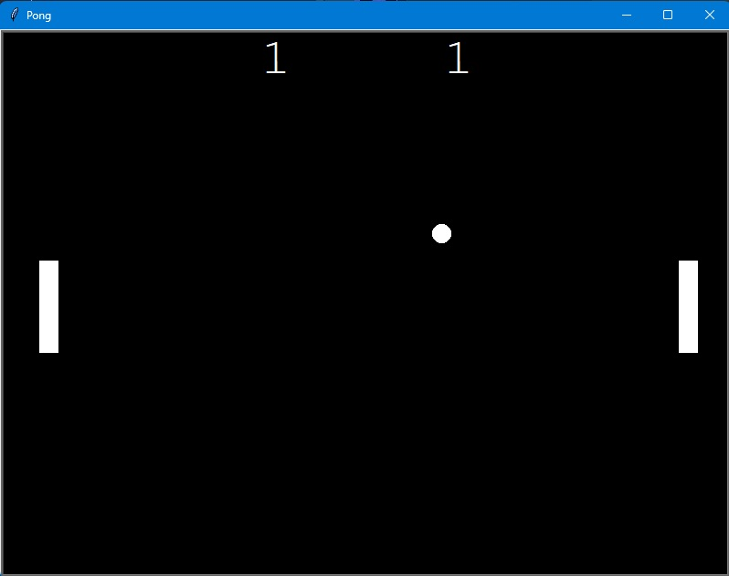
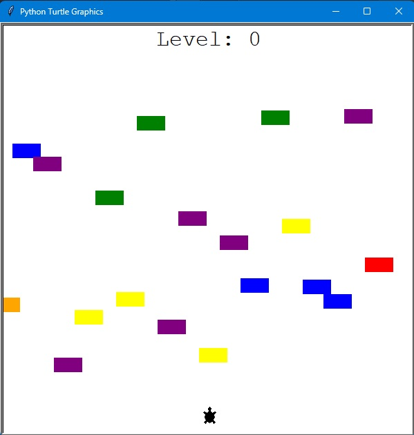
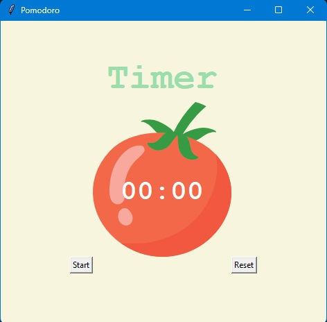
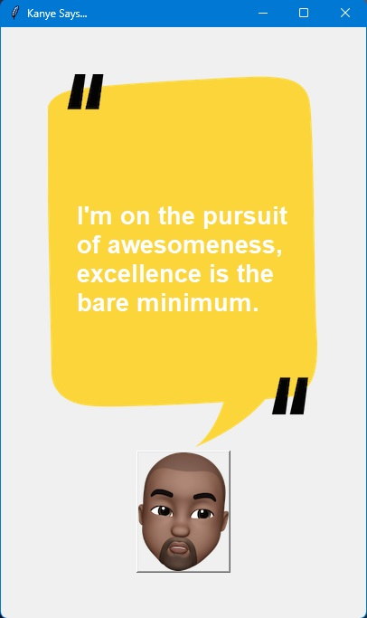

# PythonProjects

This repository showcases a collection of small Python projects that I've developed to enhance my skills in the language. Each project serves as a practical learning experience and covers a range of applications.
 
 

## Table of Contents

1. [Snake Game](#snake-game)
2. [Pong Game](#pong-game)
3. [Crossing Game](#crossing-game)
4. [US States Game](#us-states-game)
5. [Miles to KM Convertor](#miles-to-km-convertor)
6. [NATO Alphabet Convertor](#nato-alphabet-convertor)
7. [Password Manager](#password-manager)
8. [Pomodoro App](#pomodoro-app)
9. [Flash Card App](#flash-card-app)
10. [Birthday Wishes](#birthday-wishes)
11. [Kanye Quotes](#kanye-quotes)
12. [ISS Over Your Head](#iss-over-your-head)

## Snake Game

A classic Snake Game implemented in Python using Turtle graphics. Navigate the snake to collect food and grow longer while avoiding collisions with the walls and the snake's own body.

 

## Pong Game

Experience the retro thrill with a Pong Game created in Python using Turtle graphics. Compete against an AI opponent or challenge a friend for some nostalgic, fast-paced fun.

 

## Crossing Game

Test your reflexes with the Crossing Game, a Python project utilizing Turtle graphics. Guide the character safely across a busy road, avoiding oncoming traffic and reaching the destination.

 

## US States Game

Guess the US States in this interactive game created with Python, Turtle graphics, and pandas. Sharpen your knowledge of US geography by identifying states based on their shapes and names.

 

## Miles to KM Convertor

Convert miles to kilometers with this simple Python app built using tkinter. A user-friendly interface allows for quick and easy conversion between these distance units.

 

## NATO Alphabet Convertor

Transform names into the NATO alphabet using this console application built with Python and pandas. Enhance your communication skills by converting text into the widely-used phonetic alphabet.

 

## Password Manager

Manage your passwords securely with this Python-based Password Manager application, developed using tkinter. Store and retrieve passwords with ease while maintaining a high level of security.

 

## Pomodoro App

Boost your productivity with a Pomodoro App implemented in Python using tkinter. Customize your work and break intervals, and let the app guide you through productive work sessions.

 

## Flash Card App

Learn and quiz yourself with this Flash Card App built in Python, incorporating tkinter and pandas. Create personalized decks of flashcards to enhance your knowledge on various subjects.

 

## Birthday Wishes

Send heartfelt birthday wishes with this console app in Python, utilizing smtplib and pandas. Schedule and automate the sending of birthday emails to make your loved ones feel special on their big day.

 

## Kanye Quotes

Explore the wisdom and humor of Kanye West with a Python Tkinter app. A click of a button reveals a fresh Kanye quote for inspiration or amusement.

 

## ISS Over Your Head

Never miss the International Space Station! This Python console app notifies you when the ISS is visible, ensuring you catch every orbit from your location.

 

